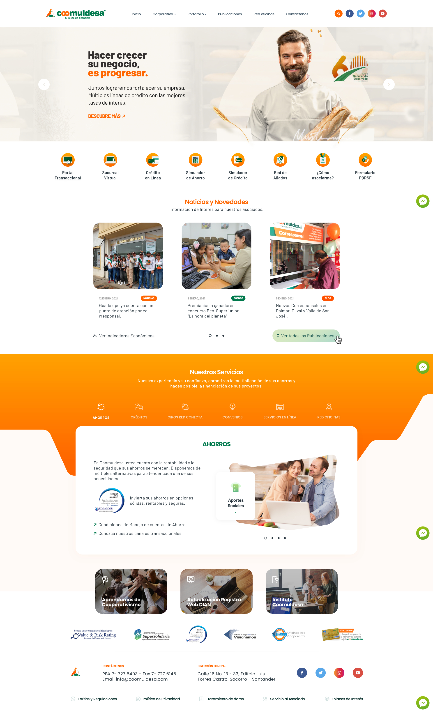

# **Prueba Técnica Maquetador Web** 🚀

## **Demo** 🔍

[Ver el sitio Aquí](https://mooenz.github.io/prueba-tecnica-maquetador-web/)

## **Proyecto** 🧾

Se requiere que realice la maquetación web (usando HTML + CSS + JavaScript + Jquery Bootstrap, etc.) de esta plantilla:

## **Contacto** 📧

- Website [mooenz.me](https://www.mooenz.me/)
- GitHub [@mooenz](https://github.com/Mooenz)
- Twitter [@mooenzdev](https://twitter.com/MooenzDev)

## **Licencia** 🛸

This project is MIT licensed
